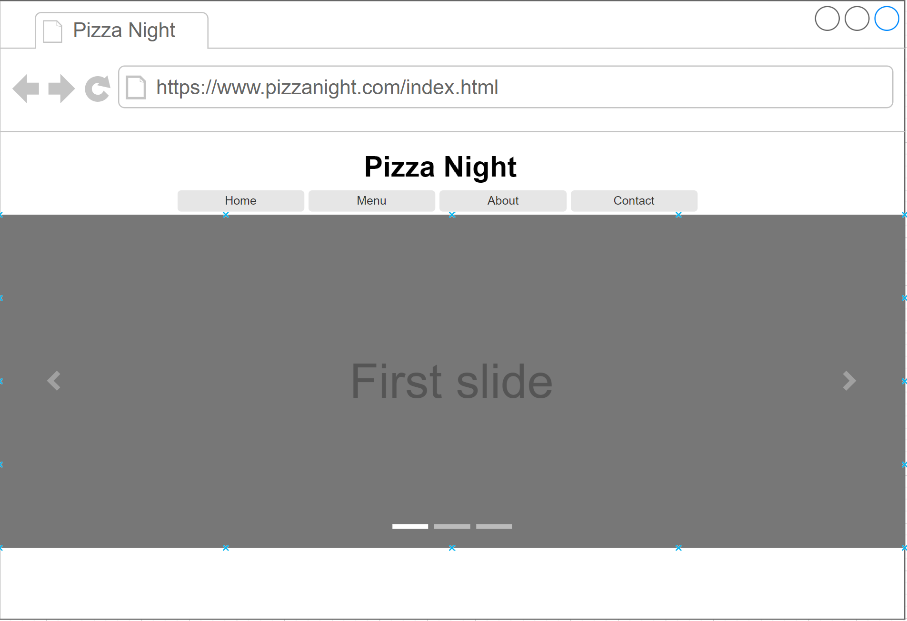
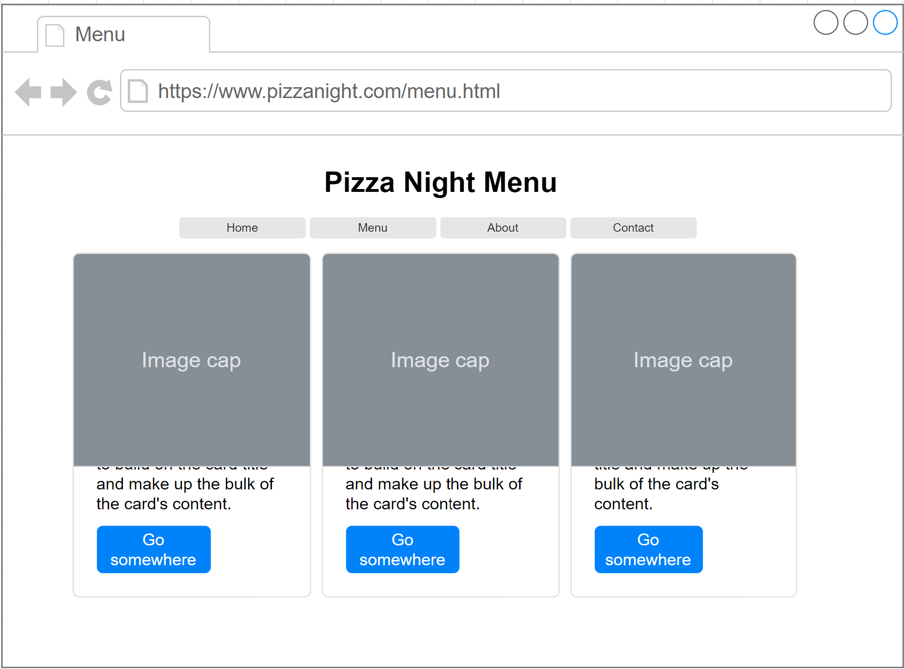
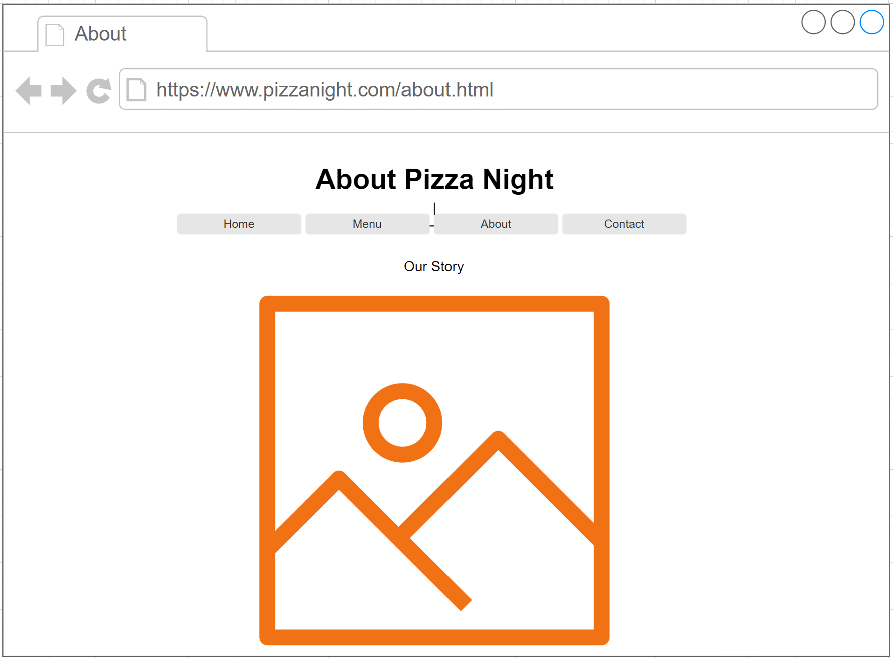
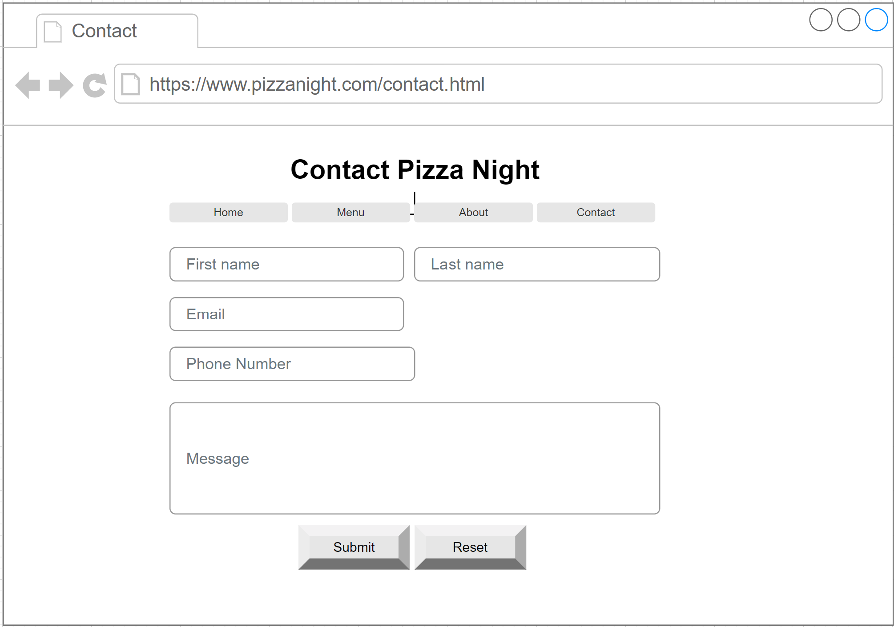
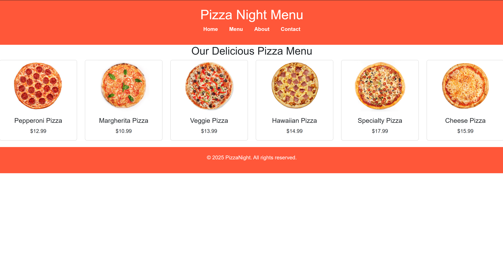
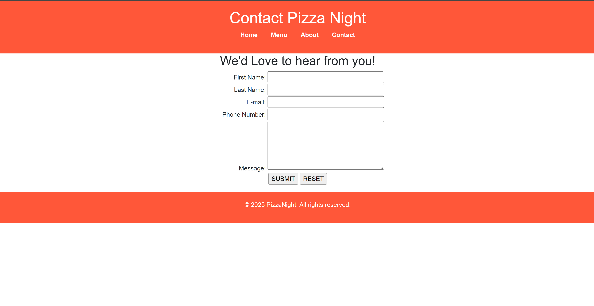

# Pizza Night

## Created by: Bryan Garcia
<a href="https://www.linkedin.com/in/bryangarcia-code" rel="nofollow">@Linkedin</a>
  

## Overview
Pizza Night is a simple responsive website designed for a fictional pizza restaurant. It includes all the essentials a local restaurant would need to promote their menu, connect with customers, and tell their story.

## Wireframe

### Home

### Menu

### About

### Contact

## Website Screenshots

### Home

### Menu

### About

### Contact

## User Stories
1. As a first-time visitor, I want to see a welcoming homepage with major deals that are offered to customers.
2. As a hungry customer, I want to view a menu with clear images and prices so that i can decide what i want to order.
3. As someone with questions or feedback, I want to fill out a simple contact form so that I can easily get in touch with the restaurant.

## Features
- Responsive multi-page website
- Navigation bar for smooth user experience
- Menu page with images and prices
- About page with restaurant background
- Contact page with form (includes required fields)
- Shared CSS styling across pages

## Technologies
- HTML
- CSS
- Bootstrap

## Future Improvements
- Add an online ordering system
- Integrate Google Maps for location
- Include customer reviews
